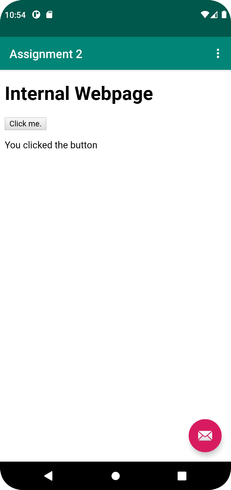

# Rapport

Skapat en webview som laddar en extern webbsida i detta fall `His.se` och laddar en intern html fil

Kodsnutten hämtar webvyn och sätter en ny web client så att webbsidan öppnas i appen istället för en extern webbläsare.
Sedan hämtas settings och JavaScript sätts till allowed

```
    myWebView = findViewById(R.id.my_webview);
    myWebView.setWebViewClient(new WebViewClient());
    WebSettings settings = myWebView.getSettings();
    settings.setJavaScriptEnabled(true);
}
```

Bilder läggs i samma mapp som markdown-filen.




Läs gärna:

- Boulos, M.N.K., Warren, J., Gong, J. & Yue, P. (2010) Web GIS in practice VIII: HTML5 and the canvas element for interactive online mapping. International journal of health geographics 9, 14. Shin, Y. &
- Wunsche, B.C. (2013) A smartphone-based golf simulation exercise game for supporting arthritis patients. 2013 28th International Conference of Image and Vision Computing New Zealand (IVCNZ), IEEE, pp. 459–464.
- Wohlin, C., Runeson, P., Höst, M., Ohlsson, M.C., Regnell, B., Wesslén, A. (2012) Experimentation in Software Engineering, Berlin, Heidelberg: Springer Berlin Heidelberg.
